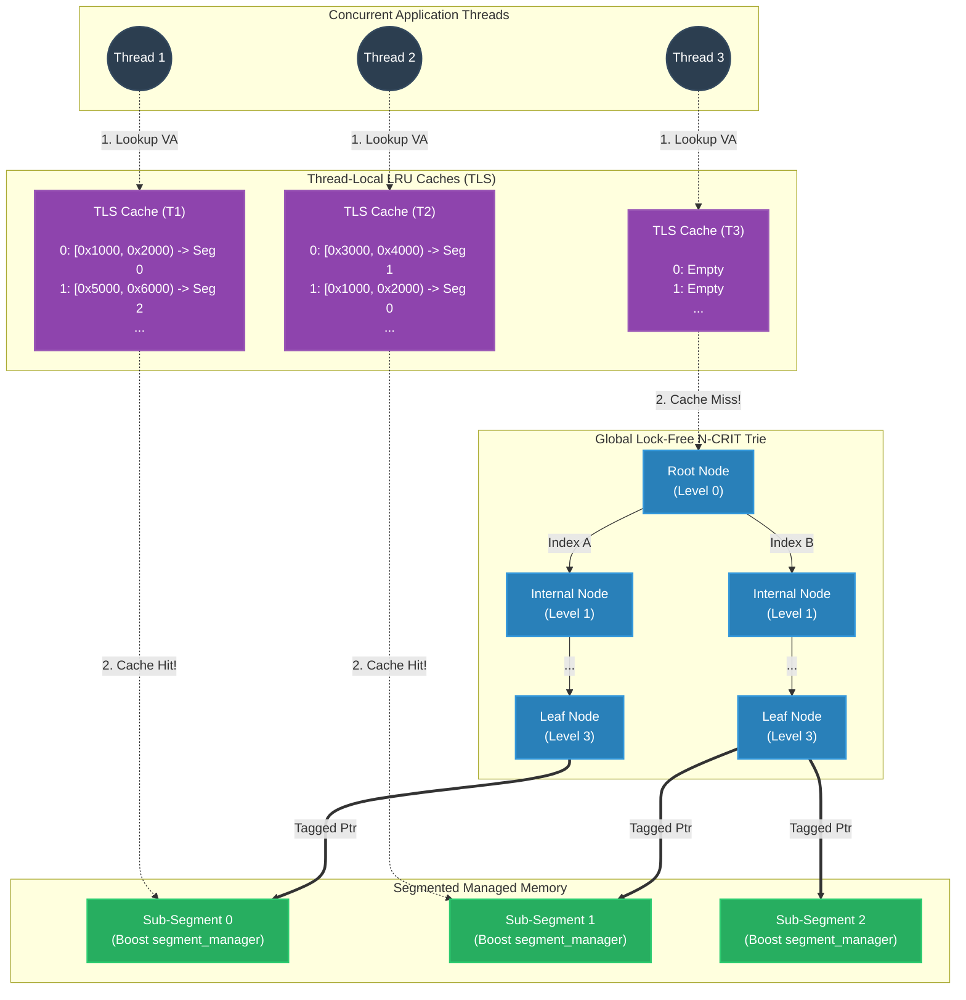
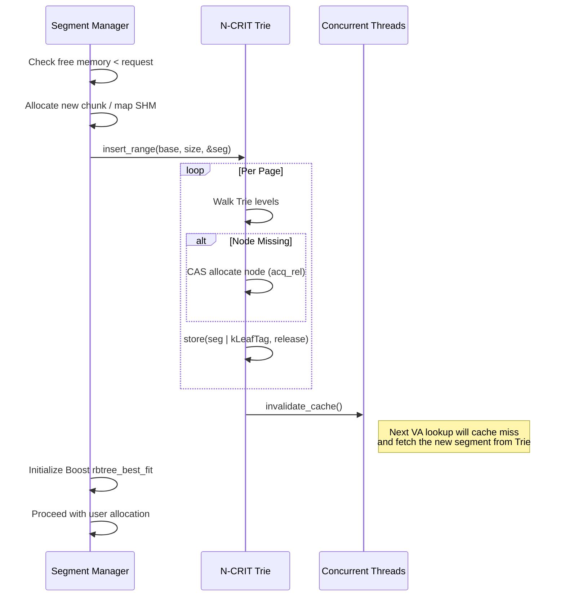

# N-CRIT Trie & Segment Management Architecture

This document visualizes the lock-free N-CRIT Radix Trie and its interaction with multiple threads and the segmented memory manager. It is designed to quickly map virtual addresses to sub-segments without relying on OS-level locks.

## Lock-Free Trie and Thread-Local Caches

The N-CRIT (N-level Concurrent Radix Indexing Trie) maps a virtual address to a specific sub-segment manager. Because resolving this mapping via tree traversal is expensive on the hot path (allocation), each thread maintains a Thread-Local LRU Cache (TLS Cache) that remembers the bounds of recently accessed sub-segments.

### Memory Request Workflow
1. **Thread Local Cache (TLS) Check**: When a thread needs to resolve an offset pointer (VA -> Sub-Segment), it checks its Thread Local LRU cache. The cache stores `[base_addr, end_addr) -> Sub-Segment Pointer`.
2. **Passive Eviction**: If the target slot is found, the thread checks the leaf node slot in the trie atomically to verify the segment wasn't unmapped (lock-free passive eviction check).
3. **Cache Hit**: The thread resolves the pointer and proceeds instantly. 
4. **Cache Miss**: The thread performs an $O(Levels)$ atomic lock-free traversal through the Trie to find the correct sub-segment pointer. It inserts this pointer into index `0` of its TLS Cache, pushing older entries down (LRU).

## Concurrent Growth and Trie Registration

When the Segmented Memory Manager runs out of space, it must register new `sub_segment`s into the N-CRIT trie.

### Trie Concurrency Safety Mechanics
- **Insertions (Growths)**:
  - Internal nodes are allocated via compare-and-swap (`CAS`). If two threads race to map memory into the same trie branch, the winner's node is used and the loser deletes its node. `memory_order_acq_rel` establishes happens-before edges.
  - Leaf nodes are updated via `memory_order_release`.
- **Lookups (Offset Pointer Resolution)**:
  - Threads read nodes using `memory_order_acquire`.
  - Stale readers reading mid-insertion might see a missing page (`nullptr`) or the new segment. Since the allocator won't return pointers in unmapped ranges, no application thread will ever access a missing trie branch during normal pointer resolution.
- **Node Lifecycle**:
  - The trie operates without Hazard Pointers or RCU. Internal nodes are never destroyed until the entire `ncrit_trie` is torn down.
  - Sub-segments can be unmapped, but they are replaced with tombstone entries (`0`) at the leaf level using an atomic release. Wait-free TLS invalidation protects cached lookups.
